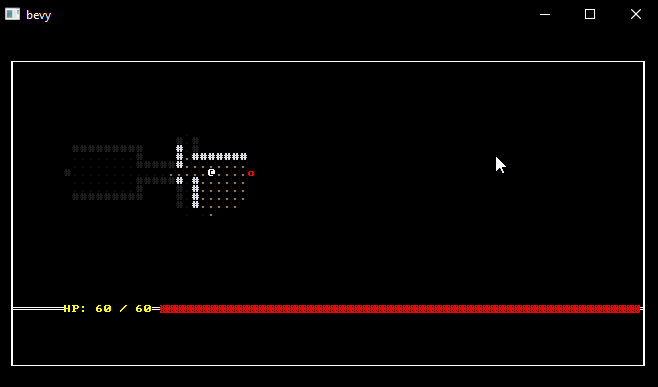

# Bevy Roguelike

My attempt to build a traditional ascii roguelike in Bevy. This work is based on my [unity version](https://github.com/sarkahn/dots-roguelike/tree/master/Assets/DotsRogue) which is itself built from the excellent [rust roguelike tutorial](https://bfnightly.bracketproductions.com/) by TheBracket. Now it's come full circle, back into rust, with bevy! 

Rendering is done natively in bevy using my [bevy_ascii_terminal](https://crates.io/crates/bevy_ascii_terminal/) crate.

[Playable web version](https://sarkahn.github.io/bevy_rust_roguelike_tut_web/) (You can move with *qweadzxc*, the arrow keys, or the numpad)

